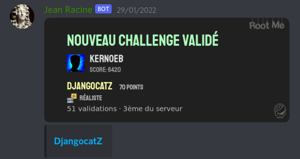
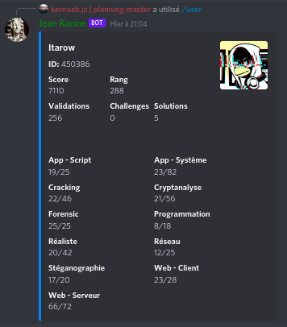
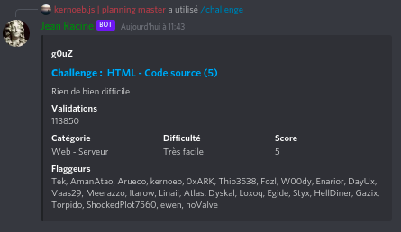
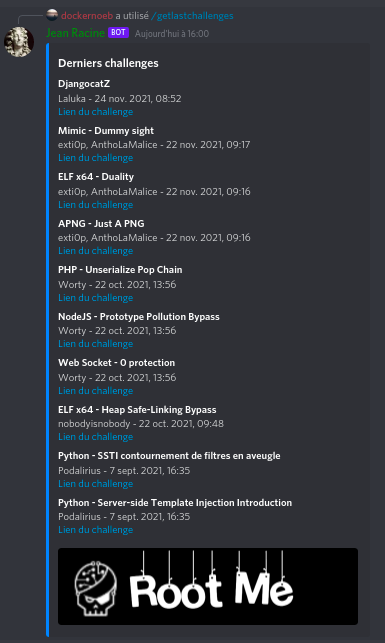
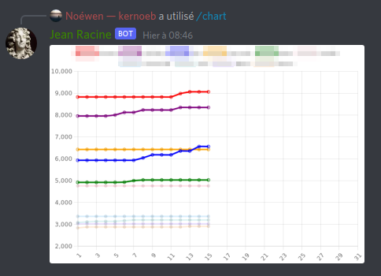

# Jean Racine

### RootMe bot

Root-Me Discord using `Discord.js` and `Slash Commands`.  
built by `@kernoeb`

### Features

- Add user / Remove user
- Scoreboard with auto update / refresh
- Notifications (new challenge added or succeed, new validation, new solution)
- Search a user or a challenge id
- Information about a challenge or a user
- Chart (leaderboard)

### Commands

`/adduser <id>`: Add a user (id)  
`/challenge <id_or_name>`: Information about a challenge  
`/chart` : Leaderboard chart  
`/createglobalscoreboard` : Create a global scoreboard  
`/deluser <id>` : Delete a user (id)  
`/getlastchallenges` : Get the last challenges   
`/help` : Help
`/init` : Initialize the bot in the channel  
`/ping` : Ping pong  
`/scoreboard <category>` : Scoreboard (with optional category)  
`/searchuser <name>` : Search a user by name  
`/user <id_or_name>` : Information about a user (id or name)

## Prerequisites

- Docker > 20
- docker-compose > 1.29 (or docker compose 2 !)
- Create a Discord bot and invite it : https://discord.com/api/oauth2/authorize?client_id=xxxx&permissions=2684472384&scope=applications.commands%20bot (replace xxxx with the bot client id)

## Installation

- Clone the repository, or only download `.env.example`, `docker-compose.yml` and `update.sh`  
You can also add the Dockerfile if you want to build the image by yourself

- Get an API Key on Root-Me [here](https://www.root-me.org/?page=preferences)
- Copy `.env.example` to `.env` and replace variables

> API_KEY is the main Root-Me API Key (premium is better!).  
> API_KEY_FIRST can be used to get all non-premium challenges, to avoid a lot of requests on your account  
> You can use an api key or a cookie

```bash
mkdir -p /opt/jeanracine
chown -R 1001 /opt/jeanracine
chmod +x ./update.sh
./update.sh
```

- Wait for the bot to load all the challenges (it can take a long time)
- Refresh Discord slash commands (this can be very long too, Discord is slow, so uncomment the line in the register_slash_commands file, with your guild id, inside the container)

```bash
docker exec -it <name-of-jean-racine-container> register_slash_commands
```


#### Optional :

Add this to your `.bashrc` :

```
function jeanracinelogs() {
  if [ $# -eq 0 ]
  then
      docker logs jean_racine_bot-rootme_node-1 --tail 20 -f
  else
      docker logs jean_racine_bot-rootme_node-1 --tail $1 -f
  fi
}
```

Open a new terminal, then try `jeanracinelogs`.

If this does not work -> `kernoeb#7737` on Discord, [@kernoeb](https://t.me/kernoeb) on Telegram :)

## Captures

**Global Scoreboard**


**Notifications**




**Information about a user**



**Information about a challenge**



**Scoreboard with arrows**


**Last challenges**



**Charts**




### Similar projects

- [RootMeBotV2](https://github.com/slowerzs/RootMeBotV2/) - Slowerzs
